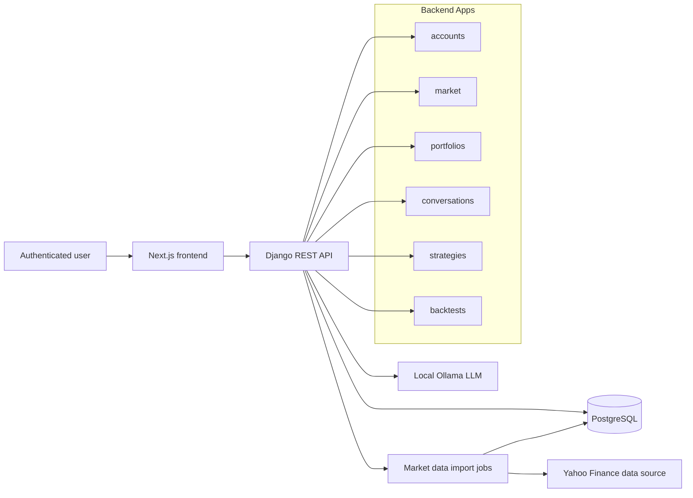
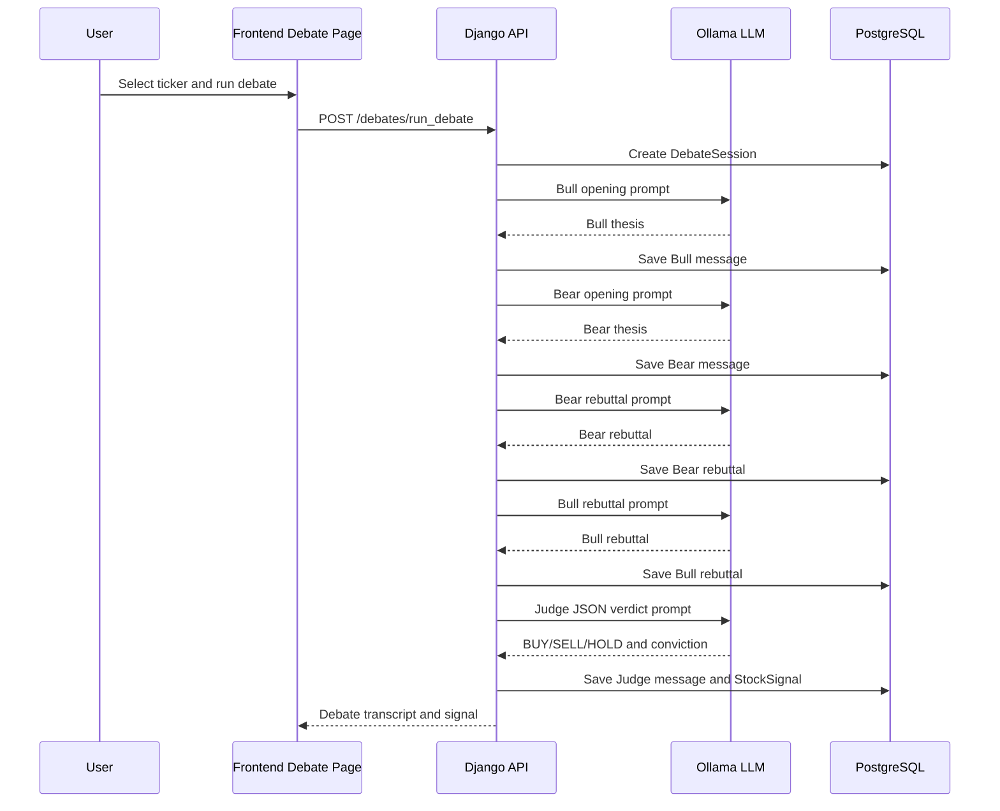
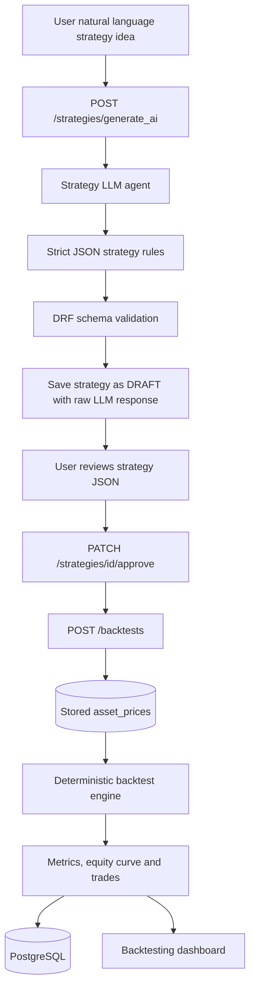
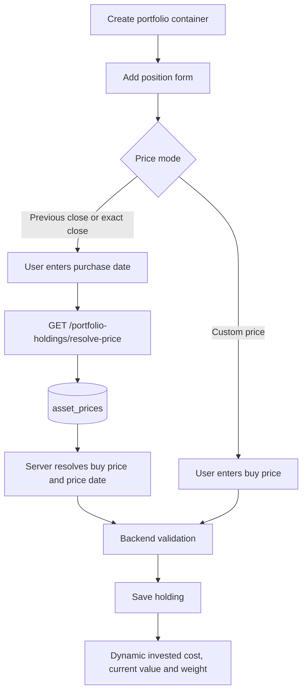
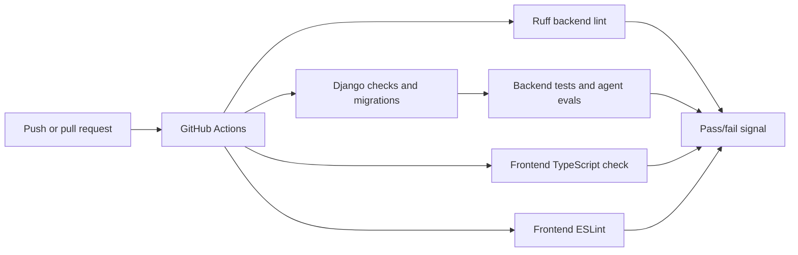

# Project Diagrams

These diagrams document the main architecture and workflows required for the MDS project evidence.

## Component Architecture

## AI Debate Workflow

## Strategy Generation And Backtesting

## Portfolio Holding Workflow

## CI And Test Workflow

